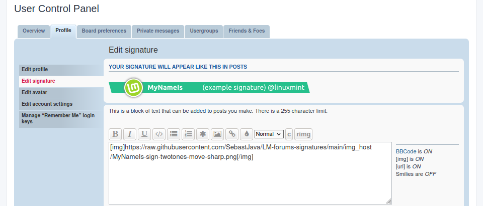

# LM-forums-signature

A new signature for the team members and sponsors on the [forums.linuxmint.com](https://forums.linuxmint.com).  


------

# Presentation
Please choose a light GitHub theme in your GitHub's [settings/appearance](https://github.com/settings/appearance) when looking at the following images.

------


### sign-flat
The logo and the background bar get their colour values from the top-left edge of the gradient colour on the main website.

The design is not too different, not too significant, thus not distracting and very professional. (Enlarged view)

------


### sign-gray
The logo gets its colour values from the top-left edge of the gradient colour on the main website. And the background bar gets a grey color. The contrast is very good for the text. And here the logo stands out against the background bar.

The design is not too different, not too significant, thus not distracting and very professional. (Enlarged view)

------


### sign-flat-move
The logo and the background bar get their colour values from the top-left edge of the gradient colour on the main website. (Enlarged view)

------


### sign-gradient-move
A fresh new look. This colour gradient is somewhat similar to the one found on the main [LinuxMint](https://linuxmint.com/) website. And the strong difference in hues makes the logo standout from the background bar. (Enlarged view)

------


### sign-flat-move-sharp
The logo and the background bar get their colour values from the top-left edge of the gradient colour on the main website.

Here there is no shadow on the background bar, giving it a sharper look. And there are no left and right margins, allowing a perfect left or right alignment. (Enlarged view)

------


### sign-twotones-move-sharp
A fresh new look. The two colour tones used here makes a good contrast between the logo and the background bar. The logo stands out. And the background hue sits within the colour gradient as found on the main website, somewhere near the bottom-right edge.

Here there is no shadow on the background bar, giving it a sharper look. And there are no left and right margins, allowing a perfect left or right alignment. (Enlarged view)

------


### sign-2lines series (6 variations)
There are two parallel lines behind. Thick lines, making a strong statement. These lines induce a sense of collective path. I got my inspiration from some old retro insignia in there. But at the same time, for the "K" and "L" versions, i added this idea of movement, this slant, as seen on previous versions. So it doesn't feel too static and retro. And, also, those lines aren't really there, they get revealed by their shadows, otherwise it would just be white on white. That's very modern. Those "K" and "L" versions are both classic and modern. There is a "signature" in those signatures... I mean, there is a concept in there. A discreet, simple concept. Just one simple concept, not trying to pack ten "great" ideas into a tiny signature... (Enlarged view)


------

# Try it !



This is not official yet. Sometime later this year, you will be invited to use a common standard signature. But there are no obligations, you can always prefer your own favourite version. Chosen from here or created on your own.

Meanwhile, we are exploring different avenues. Go ahead ! Find your preferred version and try it. You can always change your mind, anytime.

1. Choose your favourite version in the preview and presentations above.
1. Find your name and version in https://github.com/SebastJava/LM-forums-signatures/tree/main/img_host
1. Click your favourite link. Example: https://github.com/SebastJava/LM-forums-signatures/blob/main/img_host/MyNameIs15Chars-sign-twotones-move-sharp.png
1. From there, you can click on the download icon, and then upload this image to your favourite image host.
1. Or you could simply right-click to "Open Image in New Tab" and then go to this new tab with this raw image and copy this URL. Example: https://raw.githubusercontent.com/SebastJava/LM-forums-signatures/main/img_host/MyNameIs15Chars-sign-twotones-move-sharp.png
1. Now go to your [User Control Panel](https://forums.linuxmint.com/ucp.php) for the LinuxMint forums. Go to Profile > Edit signature.
1. Click on the icon to "Insert image..." and paste your image's URL. Example: ```[img]https://raw.githubusercontent.com/SebastJava/LM-forums-signatures/main/img_host/MyNameIs15Chars-sign-twotones-move-sharp.png[/img]```
1. Click on the "Preview" button to check your new signature.
1. When satisfied, click on the "Submit" button.

NOTES:

This is still under development. Current versions could get modified, and new versions could be added.

Please check for [issues](https://github.com/SebastJava/LM-forums-signatures/issues).