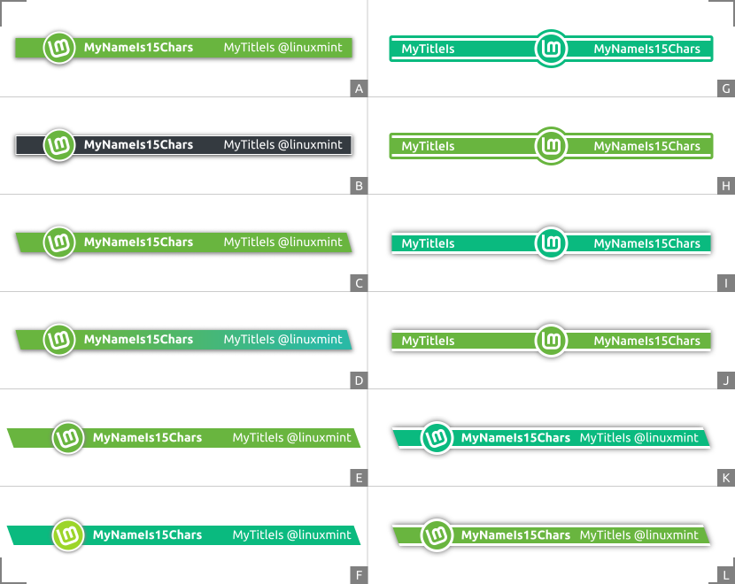

# LM-forums-signature

A new signature for the team members and sponsors on the [forums.linuxmint.com](https://forums.linuxmint.com).  

| Row  | Image name | Row  | Image name |
| -------- | ------------------- | -------- | ------------------- |
| A  | sign-flat.png                    | B  | sign-gray.png                             |
| C  | sign-gradient-move.png  | D  | sign-flat-move.png                    |
| E  | sign-flat-move-sharp.png | F  | sign-twotones-move-sharp.png |

Here the signatures are pictured on the two alternating background colours as found on the current LinuxMint forums: white and off white (`#E0EDD3`). Off course, these backgrounds could be made different on some future forum designs.

------

### sign-flat
This is the standard logo colour, on the logo. And the background bar gets its colour value from the top-left edge of the gradient colour on the main website. (Enlarged view. Please choose a light GitHub theme in [settings/appearance](https://github.com/settings/appearance).)

------

### sign-gray
This is the standard logo colour, on the logo. And the background bar gets a pure neutral grey. The contrast is very good for the text. And here again the logo stands out against the background bar.

Two parallel lines got added along the background bar to differentiate this dark bar from the shadow, otherwise it was just looking like some blurred rectangle. Those thin lines also adds some kind of retro high class spirit here. (Enlarged view. Please choose a light GitHub theme in [settings/appearance](https://github.com/settings/appearance).)

------

### sign-gradient-move
A fresh new look. This colour gradient is similar to the one found on the main [LinuxMint](https://linuxmint.com/) website. And the difference in hues makes the logo standout from the background bar. This one is ready for some future forum design. (Enlarged view. Please choose a light GitHub theme in [settings/appearance](https://github.com/settings/appearance).)

------

### sign-flat-move
This is the standard logo colour, on the logo. And the background bar gets its colour value from the top-left edge of the gradient colour on the main website. (Enlarged view. Please choose a light GitHub theme in [settings/appearance](https://github.com/settings/appearance).)

------

### sign-flat-move-sharp
This is the standard logo colour, on the logo. And the background bar gets its colour value from the top-left edge of the gradient colour on the main website. Here there is no shadow on the background bar, giving it a sharper look. (Enlarged view. Please choose a light GitHub theme in [settings/appearance](https://github.com/settings/appearance).)

------

### sign-twotones-move-sharp
A fresh new look. The two colour tones used here makes a good contrast between the logo and the background bar. The logo stands out. And the background hue sits within the colour gradient as found on the main website, somewhere near the bottom-right edge. This version is ready for some future forum design. (Enlarged view. Please choose a light GitHub theme in [settings/appearance](https://github.com/settings/appearance).)